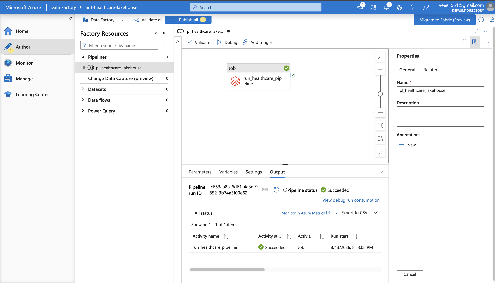
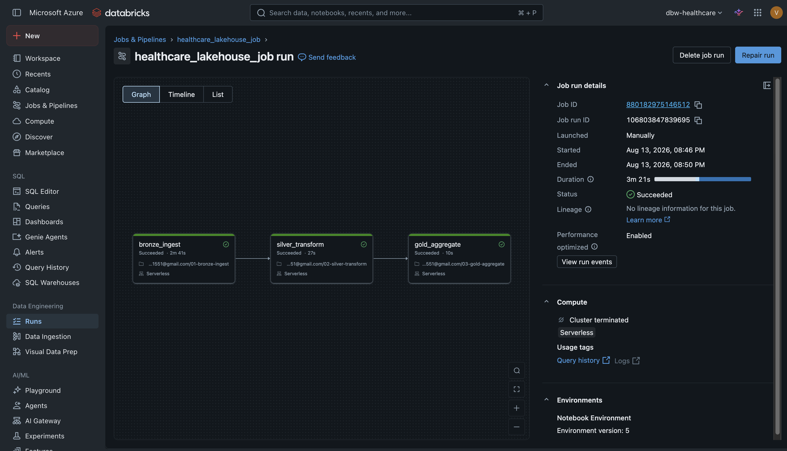
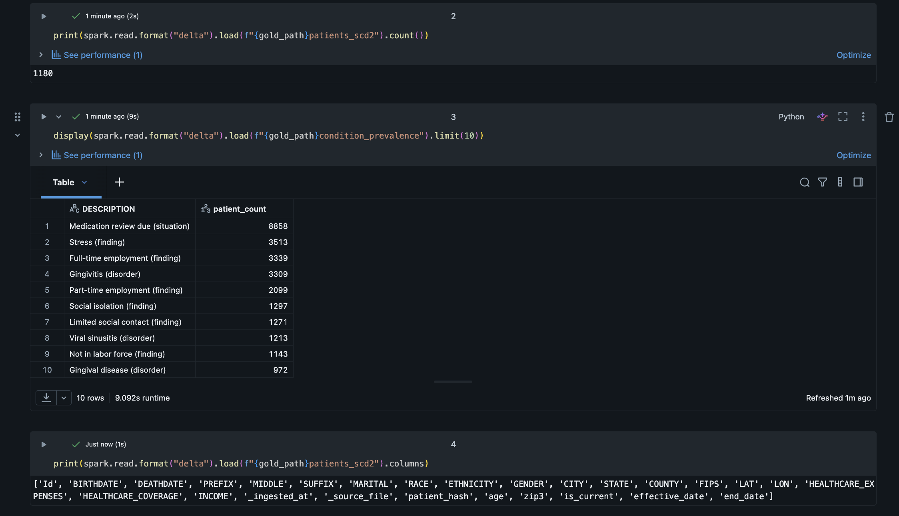
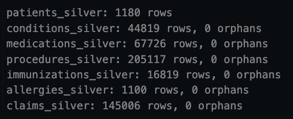
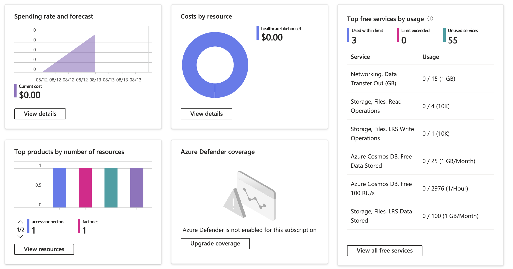
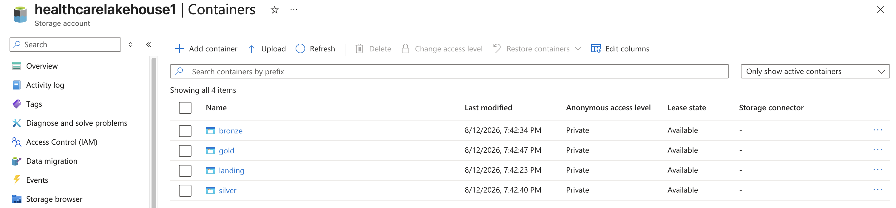

# Healthcare Data Lakehouse on Azure

A HIPAA-aware, medallion-architecture data pipeline for multi-table clinical data, orchestrated with Azure Data Factory and processed with Databricks serverless PySpark on Delta Lake.

## Data source disclosure

**All patient data in this project is synthetic**, generated using [Synthea](https://github.com/synthetichealth/synthea), an open-source synthetic patient generator. No real patient records were used at any stage. Dataset: 1,180 synthetic patients (1,000 living, 180 deceased), 10 years of simulated history, generated for Massachusetts.

## Infrastructure status

This pipeline was built and validated on live Azure infrastructure — ADLS Gen2, Azure Databricks (Premium, serverless-only workspace), and Azure Data Factory — using Azure's free trial credit. **Total spend was $0.00** (confirmed in Cost Management, see evidence below), and resources were decommissioned after evidence capture. This is not a currently-deployed system; see "How to reproduce" below to redeploy it.

## Architecture

```
Synthea (synthetic patient generator)
        │
        ▼
   [landing/]  ← raw CSV: patients, encounters, conditions,
        │         medications, procedures, claims, immunizations, allergies
        ▼
Azure Data Factory  (Databricks Job activity)
        │
        ▼
Databricks Workflow "healthcare_lakehouse_job"  (serverless compute, 3 chained tasks)
        │
   ┌────┴────────┬──────────────┐
   ▼              ▼              ▼
bronze_ingest → silver_transform → gold_aggregate
   │              │                  │
   ▼              ▼                  ▼
[bronze/]      [silver/]          [gold/]
raw Delta      de-identified,     SCD Type 2 patient dim,
ingestion      deduplicated,      condition prevalence
               referential        cohort tables
               integrity
               enforced
```

Storage: Azure Data Lake Storage Gen2 (`healthcarelakehouse01`, hierarchical namespace enabled), four containers (`landing`, `bronze`, `silver`, `gold`) mapping to the medallion layers. Databricks connects via Unity Catalog External Locations, authenticated through an Azure Managed Identity (Access Connector for Azure Databricks) — no storage account keys embedded in code.

## Why a Databricks Job activity instead of ADF Notebook activities

The Databricks workspace used here is provisioned **serverless-only** — there is no classic-compute option available at all (confirmed by checking workspace admin settings; the compute page has no cluster-creation toggle). ADF's older per-notebook Notebook activity requires a cluster to be configured in its linked service, which fails outright against a serverless-only workspace (`[3201] Only serverless compute is supported in the workspace`).

The fix: the three notebooks are wrapped in a single Databricks Workflow (Job) that runs entirely on serverless compute, and ADF triggers that whole Job as one activity using the **Databricks Job activity** — Microsoft and Databricks' current recommended orchestration pattern for exactly this scenario. This is a design decision driven by the workspace configuration, not a downgrade from the original three-activity plan.

## What each layer does

**Bronze** — raw ingestion of all 8 source tables as-is, schema-on-read, tagged with ingestion timestamp and source file for lineage.

**Silver** — the healthcare-specific engineering:
- **HIPAA Safe Harbor de-identification**: patient names, SSN, driver's license, passport, exact address, and birthplace are dropped; ZIP code is generalized to a 3-digit prefix; date of birth is converted to age.
- **Referential integrity enforcement**: every child table (conditions, medications, procedures, immunizations, allergies, claims) is validated against `patients` via a foreign key join before being written — the pipeline fails loudly (assertion error) rather than silently writing orphaned records. Note: `claims.csv` uses a differently-named foreign key (`PATIENTID`) than the other five tables (`PATIENT`) — handled explicitly in the transform, after an initial run failed with an `[ATTRIBUTE_NOT_SUPPORTED]` error under Spark Connect's strict column-name resolution.
- Deduplication on all child tables.

**Gold** — analysis-ready tables:
- `patients_scd2`: Slowly Changing Dimension Type 2 on the patient dimension, tracking attribute history (e.g., ZIP changes) with `is_current` / `effective_date` / `end_date` columns. Merge logic tested against a simulated 5% mutation of the patient population, correctly closing out 51 prior versions while preserving 1,180 current records.
- `condition_prevalence`: aggregated cohort table, condition counts across the population.

## Tech stack

Azure Data Factory (V2) · Azure Databricks (Premium, serverless) · Unity Catalog · Azure Data Lake Storage Gen2 · PySpark · Delta Lake · Python

## Evidence

Screenshots documenting actual execution:

### ADF pipeline run

ADF pipeline `pl_healthcare_lakehouse` run, Output tab — `run_healthcare_pipeline` activity Succeeded.

### Databricks Job run

Databricks Workflow `healthcare_lakehouse_job` run — all 3 tasks (`bronze_ingest`, `silver_transform`, `gold_aggregate`) succeeded, total duration 3m 21s, running on serverless compute.

### De-identification confirmed

Output of `patients_scd2.columns` — confirms `SSN`, `FIRST`, `LAST`, `ADDRESS`, `DRIVERS`, `PASSPORT`, `MAIDEN`, `BIRTHPLACE`, `ZIP` are absent from the de-identified table.

### Gold layer output

Sample rows from `condition_prevalence` — top result "Medication review due (situation)" at 8,858 occurrences across the population.

### Referential integrity

0 orphaned records across all 6 child tables, full 1,180-patient dataset. Captured on Databricks Free Edition while validating the transform logic prior to Azure deployment; the identical logic (including these same assertion checks) ran successfully on Azure, confirmed by the `silver_transform` task showing Succeeded above — an assertion failure would have failed that task outright rather than showing green.

### Cost — confirmed $0.00

Azure Cost Management — confirmed $0.00 total spend for this project.

### Storage layer structure

ADLS Gen2 `healthcarelakehouse01` storage account — `bronze`, `gold`, `landing`, `silver` containers.

## Validated run results

- Source: 1,180 patients (1,000 living, 180 deceased)
- Bronze: 1,180 rows ingested to `patients`, 8/8 tables loaded
- Silver: 1,180 rows in `patients_silver`, 0 orphaned records across all 6 child tables
- Gold: 1,180 rows in `patients_scd2` on initial load; after SCD2 merge test (simulated 5% patient attribute change), 1,180 current + 51 closed-out prior versions
- Full pipeline (ADF → Databricks Job, 3 chained tasks) completed in 3m 21s end to end
- Total Azure spend: $0.00

## Repository structure

```
notebooks/           PySpark source for Bronze, Silver, Gold (Databricks notebook format)
docs/screenshots/    Execution evidence (see table above)
docs/                Data quality check documentation, cost report
architecture/        Architecture diagram
data/sample/         Referentially-consistent 200-patient sample of Synthea CSV output for local testing without Azure
```

## How to reproduce

1. Generate synthetic data: `synthea -p 1000 --exporter.csv.export=true --exporter.years_of_history=10 --exporter.baseDirectory=./output_1k Massachusetts`
2. Provision Azure: resource group, ADLS Gen2 (hierarchical namespace enabled), Azure Databricks (Premium), Access Connector for Azure Databricks, Azure Data Factory
3. Grant the Access Connector's managed identity `Storage Blob Data Contributor` on the storage account
4. In Databricks, create a Storage Credential (Azure Managed Identity type) and an External Location for each container (`landing`, `bronze`, `silver`, `gold`)
5. Upload source CSVs to the `landing` container
6. Create a Databricks Workflow with three chained Notebook tasks — `bronze_ingest` → `silver_transform` → `gold_aggregate` — each on serverless compute; run it once standalone to confirm all 3 succeed
7. In ADF, create an Azure Databricks linked service (Access Token auth), then a pipeline with a single **Databricks Job** activity pointing at the Workflow created in step 6
8. Validate and run the ADF pipeline

## Design decisions worth noting

- **Serverless over classic clusters**: driven by the workspace configuration, not a preference — see "Why a Databricks Job activity" above.
- **Managed identity over storage keys**: production data paths authenticate via Unity Catalog External Locations backed by an Azure Managed Identity, not embedded account keys.
- **Cost discipline**: all Azure resources were deleted after evidence capture; confirmed $0.00 total spend for the entire build and validation cycle.

## Author

**Vaibhav Sathe**
- Email: [vaibhavag0207@gmail.com](mailto:vaibhavag0207@gmail.com)
- LinkedIn: [linkedin.com/in/vaibhav-sathe-115507194](https://linkedin.com/in/vaibhav-sathe-115507194)
- Portfolio: [vaibhavsathe.vercel.app](https://vaibhavsathe.vercel.app)
